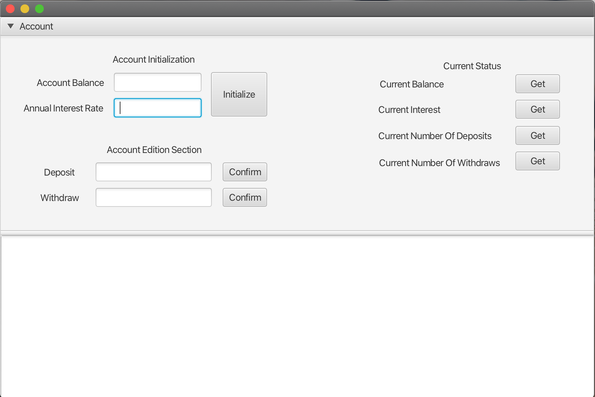

# COP 2800 / Final Project

**Author:** Antonio Nazco

## Requirements
To compile and exceute this application is required the user follow the below directions

1. Java SDK must be installed. (If not please follow the [link](https://www.oracle.com/java/technologies/javase/jdk11-archive-downloads.html))
2. JavaFx SDK must be installed. (If not please follow the [link](https://openjfx.io/))
3. You must have an IDE to work with the code. For this specific project I used VSCode, click [here](https://code.visualstudio.com/download) if you want to use it as well 
4. Java Fx must contain the reference of its libraries to be able to compile. In this project we set up this path as it is shown in the launch.json.

###### Note: vmArgs contains the path of my JavaFx libraries

```JSON
    {
	"version": "0.2.0",
	"configurations": [
		{
			"type": "java",
			"name": "Launch Demo",
			"request": "launch",
			"mainClass": "Demo",
			"projectName": "App_6e076b4c"
		},
		{
			"type": "java",
			"name": "Launch Demo",
			"request": "launch",
			"mainClass": "models.Demo",
			"projectName": "App_6e076b4c"
		},
		{
			"type": "java",
			"name": "Launch Current File",
			"request": "launch",
			"mainClass": "${file}"
		},
		{
			"vmArgs": "--module-path \"/Users/tonynazcomenendez/javafx/javafx-sdk-19/lib\" --add-modules javafx.controls,javafx.fxml",
			"type": "java",
			"name": "Launch App",
			"request": "launch",
			"mainClass": "App"
		}
	]
}
```

## Running the APP

Once you complete the set up you will be able to run the application



## About the GUI

This application has been perform to work with the instance of the Saving Account

With the app you will be able to:
- Initialize an instace of Saving Account by pressing Initialize button once Account Balance and Anual Interest Rate have been filed.

- Make a deposit by pressing Confirm button once Deposit has been filled

- Make a withdraw by pressing Confirm button once Withdraw has been filled

- Get the current status of the below:

    - Current Balance
    - Current Interest
    - Current Number of Deposits
    - Current Number of Withdraws

#  
